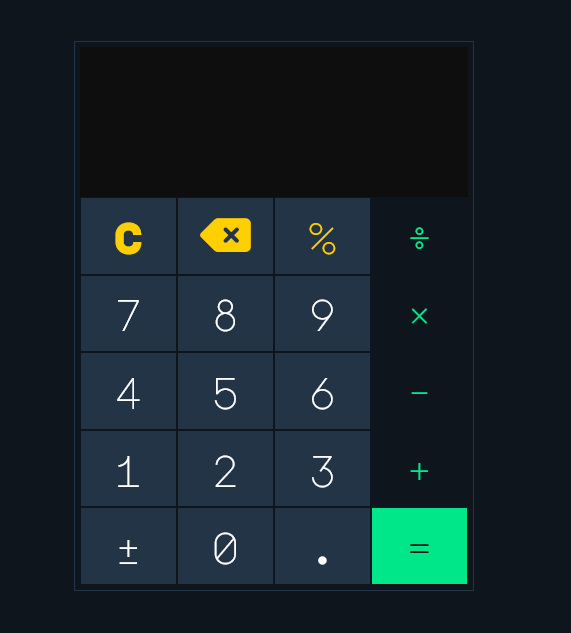

# Calculator
This is a calculator that was implemented using only HTML, CSS and JavaScript. Your results will be displayed up to 5 decimal digits.

    

### Here you can use and play with the [Live Demo](https://iaaron-xyz.github.io/calculator/) :point_left:
